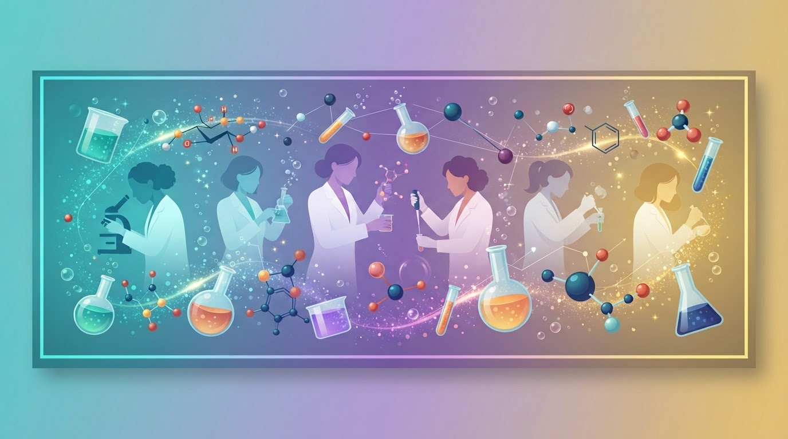
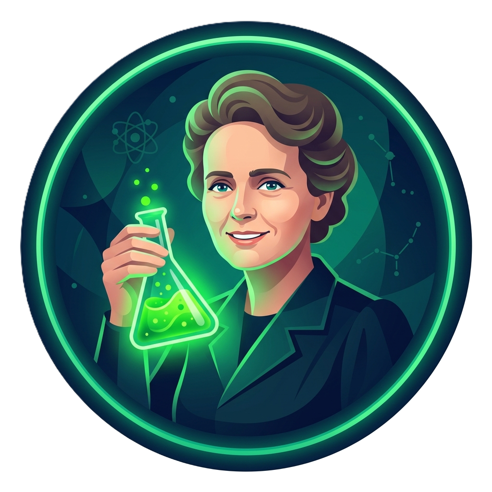
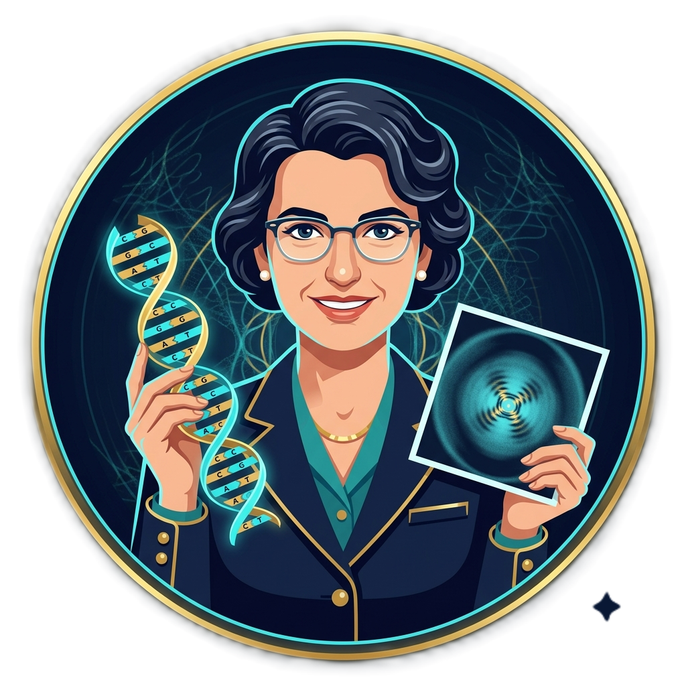
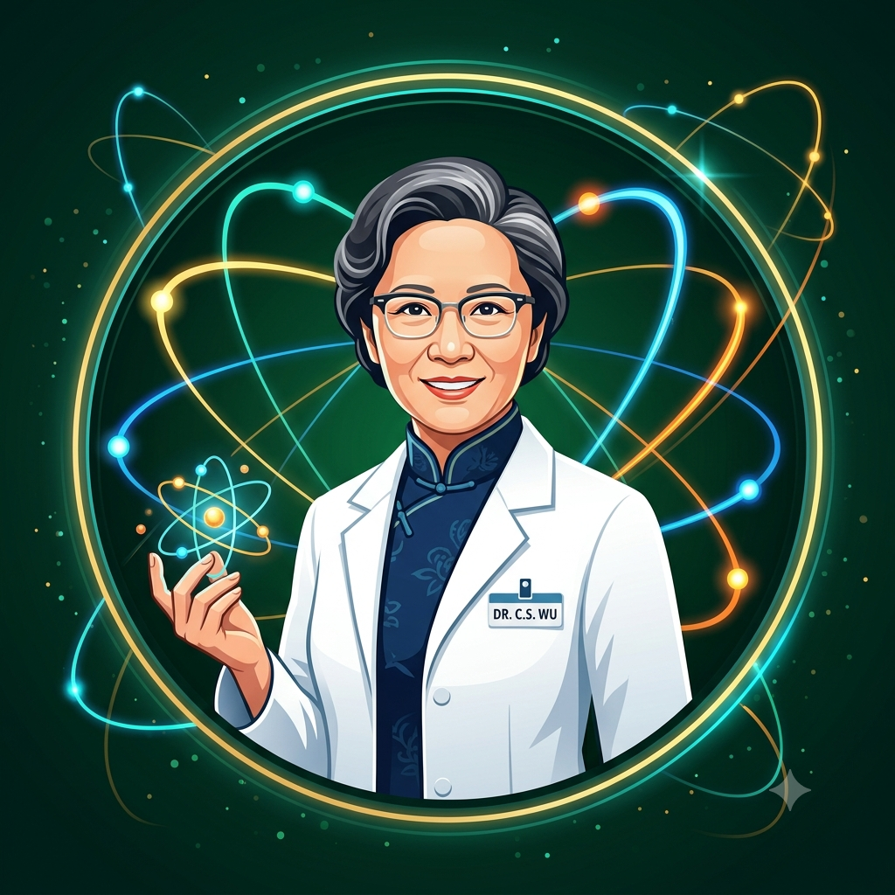
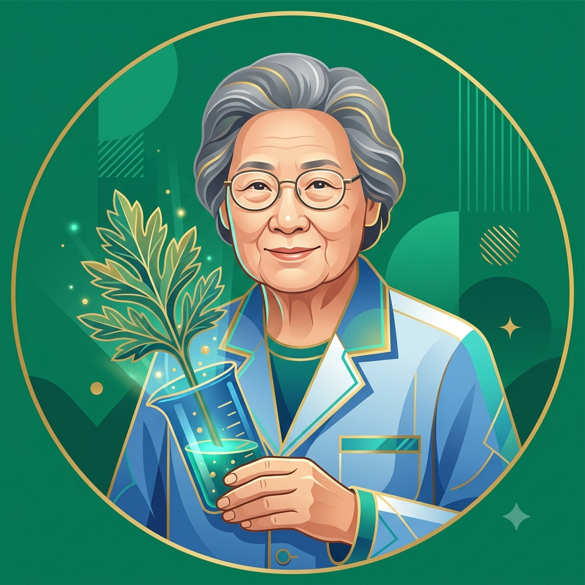
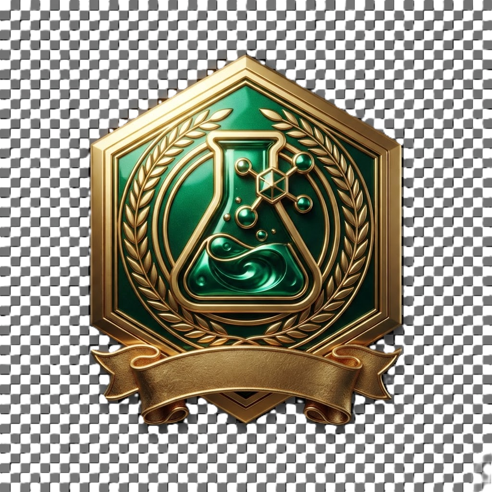
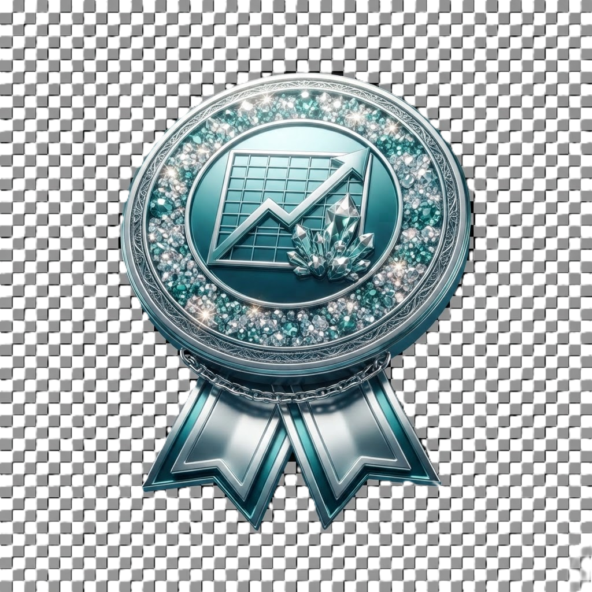
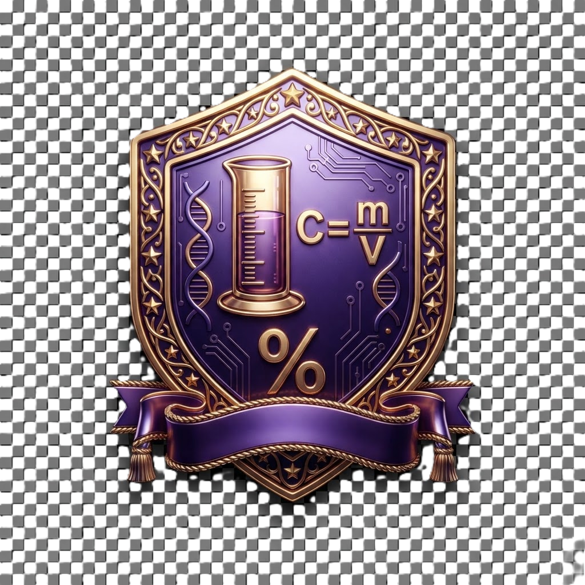
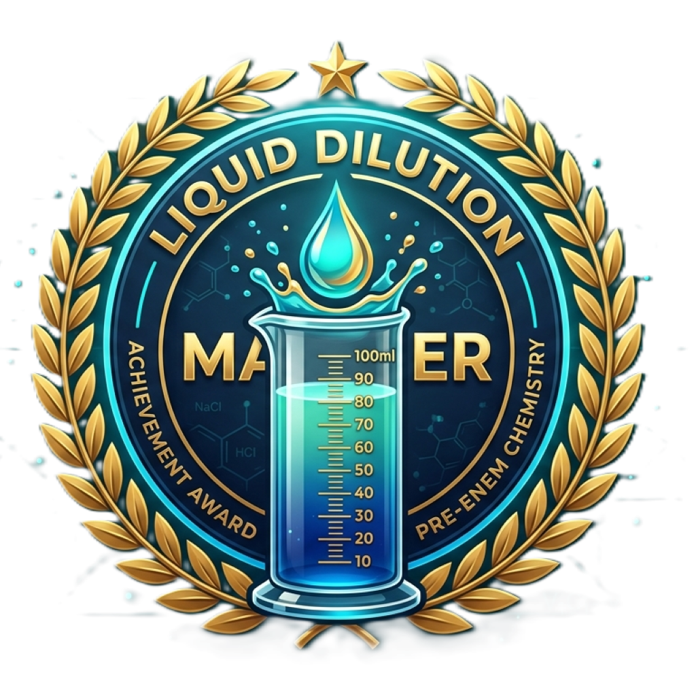
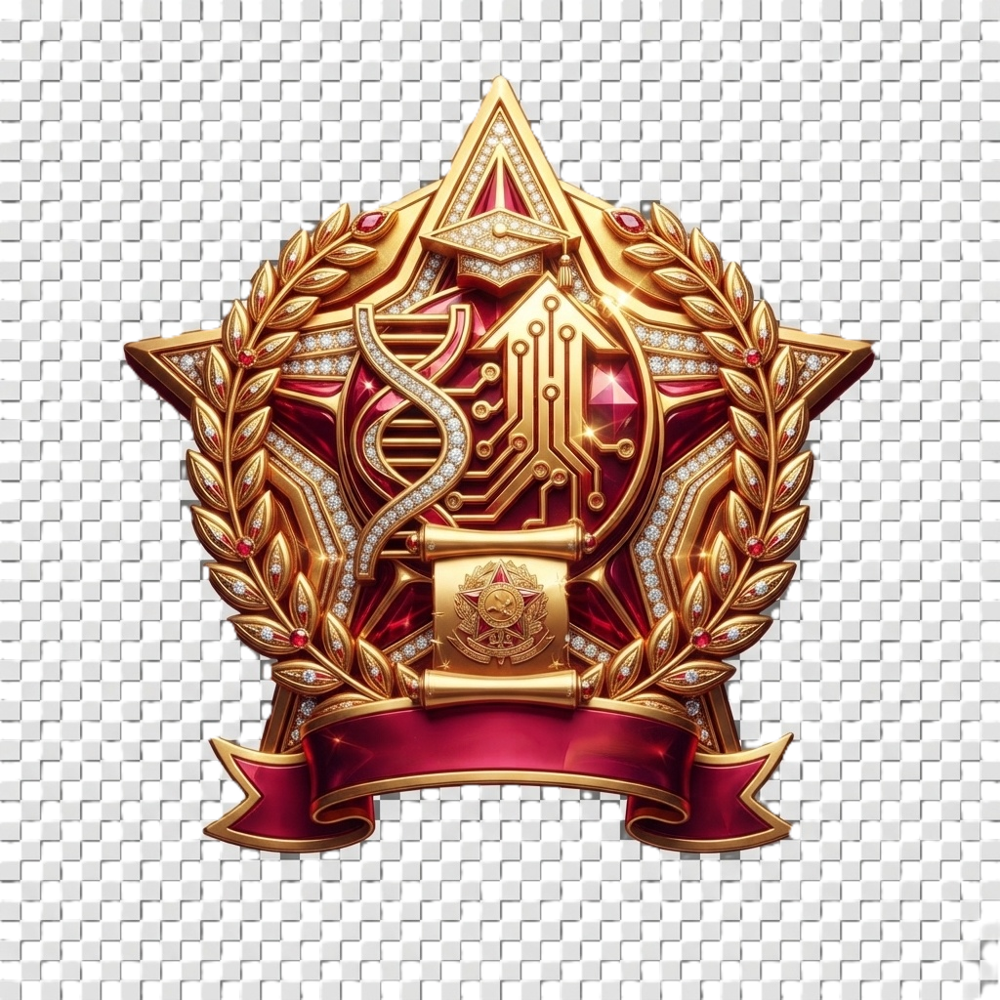

<div align="center">



# 🧪 Pré-ENEM Digital MT · Química
### Estudo das Soluções — Aula Interativa Gamificada

 &nbsp;&nbsp;&nbsp; 

**Ação governamental de educação pública · Desenvolvimento autoral Bio+Tech EduDesign**

[](#)
[](LICENSE)
[](#)
[](#)
[](#)

</div>

---

## 📖 Sobre o Projeto

O **Pré-ENEM Digital MT** é uma iniciativa educacional do **Governo do Estado de Mato Grosso** (SEDUC-MT) voltada à preparação de estudantes da rede pública para o Exame Nacional do Ensino Médio (ENEM). Esta aula interativa aborda um dos tópicos mais recorrentes da prova de Ciências da Natureza: **Estudo das Soluções (Química)**.

O material foi concebido pela marca **Bio+Tech EduDesign**, com desenvolvimento autoral aplicando **metodologias ativas de aprendizagem** — **Aprendizagem Baseada em Problemas (ABP)** combinada com **Gamificação** — para transformar o estudo de química em uma jornada imersiva, representativa e inspiradora.

---

## 🎯 Objetivos Pedagógicos

- ✅ Consolidar os principais conceitos de **soluções químicas** exigidos no ENEM.
- ✅ Estimular o **raciocínio lógico-matemático** aplicado a problemas reais.
- ✅ Praticar com **questões oficiais do ENEM** (2019, 2020, 2023) e questões inéditas do mesmo estilo.
- ✅ Promover **engajamento** através de mecânicas de jogo (XP, badges, ranking, vidas).
- ✅ Celebrar o **protagonismo feminino na ciência** por meio de mentoras históricas.

---

## 🧬 Metodologias Ativas Aplicadas

### 1️⃣ Aprendizagem Baseada em Problemas (ABP)
Cada missão inicia com um **cenário-problema real** que contextualiza a teoria:
- Contaminação de rio (OD/DBO)
- Combate à dengue com larvicidas diluídos
- Análise de fluoreto na água potável
- Dosagem de soro fisiológico e ureia (função renal)
- Preservação da salinidade marítima (NaCl)

### 2️⃣ Gamificação
- ⭐ **Sistema de XP** progressivo
- ❤️ **3 vidas** por sessão
- 🏅 **Badges gráficas 3D** conquistáveis (uma por missão)
- 📊 **Barra de progresso** global (0–100%)
- ⏱️ **Timer regressivo** em cada questão
- 🎊 **Confetes animados** ao acertar
- 🏆 **Ranking final** (Iniciante → Aprendiz → Experiente → Mestre)

### 3️⃣ Storytelling com Mentoras Cientistas
Seis cientistas históricas atuam como **mentoras narrativas**, oferecendo dicas contextualizadas conforme sua área de atuação real.

---

## 👩‍🔬 Galeria de Mentoras Cientistas

<table>
<tr>
  <td align="center"><br><b>Marie Curie</b><br><sub>Radioatividade & Química</sub></td>
  <td align="center"><br><b>Rosalind Franklin</b><br><sub>Cristalografia & Biofísica</sub></td>
  <td align="center"><br><b>Chien-Shiung Wu</b><br><sub>Física Nuclear</sub></td>
</tr>
<tr>
  <td align="center"><br><b>Nise da Silveira</b><br><sub>Psiquiatria & Humanas</sub></td>
  <td align="center"><br><b>Katherine Johnson</b><br><sub>Matemática & Ciência Espacial</sub></td>
  <td align="center"><br><b>Tu Youyou</b><br><sub>Farmacologia · Nobel 2015</sub></td>
</tr>
</table>

---

## 🏅 Sistema de Badges

Cada missão concede uma badge exclusiva ao ser concluída:

<table>
<tr>
  <td align="center"><br><b>M1</b><br>Pioneir@ das Soluções</td>
  <td align="center"><br><b>M2</b><br>Mestre da Solubilidade</td>
  <td align="center"><br><b>M3</b><br>Mentor(a) das Concentrações</td>
  <td align="center"><br><b>M4</b><br>Cientista de Laboratório</td>
  <td align="center"><br><b>M5</b><br>Lenda do ENEM</td>
</tr>
</table>

---

## 🗺️ Trilha de Aprendizagem (5 Missões)

| # | Missão | Conteúdo | Questões |
|---|---|---|---|
| 1 | 🧪 **O que é uma Solução?** | Soluto, solvente, classificação (insaturada/saturada/supersaturada) | Extra + ENEM 2023 |
| 2 | 📊 **Coeficiente de Solubilidade** | Curvas, efeito da temperatura, corpo de fundo | ENEM (NaCl/Pessoa) + Extra (KNO₃) |
| 3 | ⚗️ **Concentrações** | C (g/L), título %, ppm, molaridade, diluição | ENEM 2019 (dengue) + ENEM (ureia) |
| 4 | 🎮 **Laboratório Virtual** | Simulador interativo de diluição com sliders | Prática ao vivo |
| 5 | 🏆 **Boss ENEM** | Desafio final cronometrado | ENEM 2020 (OD/DBO) + Extra (flúor) |

---

## 🚀 Como Usar

### 🌐 Online (GitHub Pages)
Acesse: `https://<seu-usuario>.github.io/<nome-do-repo>/`

### 💻 Local
```bash
git clone https://github.com/<seu-usuario>/pre-enem-quimica-solucoes.git
cd pre-enem-quimica-solucoes
# Abra index.html em qualquer navegador moderno
# Ou rode um servidor local:
python3 -m http.server 8000
# Acesse http://localhost:8000
```

### 🎓 Em Sala de Aula
1. **Projeção coletiva** — o professor conduz a turma missão a missão.
2. **Uso individual** — cada aluno acessa em seu dispositivo.
3. **Competição** — divida a turma em equipes e compare o XP final.

---

## 📁 Estrutura do Projeto

```
pre-enem-quimica-solucoes/
├── index.html                          # Página principal
├── README.md                           # Este arquivo
├── LICENSE                             # Licença MIT
├── .nojekyll                           # Bypass Jekyll no GitHub Pages
├── css/
│   └── style.css                       # Estilos completos
├── js/
│   └── app.js                          # Lógica da aula + questões
├── assets/
│   ├── favicon.png                     # Ícone da aba
│   ├── hero.png                        # Banner do README
│   ├── avatars/                        # 6 mentoras cientistas
│   │   ├── curie.png
│   │   ├── franklin.png
│   │   ├── wu.png
│   │   ├── nise.png
│   │   ├── johnson.png
│   │   └── tuyouyou.png
│   ├── badges/                         # 5 badges 3D
│   │   ├── badge_m1.png
│   │   ├── badge_m2.png
│   │   ├── badge_m3.png
│   │   ├── badge_m4.png
│   │   └── badge_m5.png
│   └── logos/                          # Logos institucionais
│       ├── biotech_edudesign.png
│       └── gov_mato_grosso.png
└── docs/
    └── modelo_conceitual.md            # Documento pedagógico
```

---

## 🌐 Publicar no GitHub Pages

1. Crie um repositório no GitHub (ex.: `pre-enem-quimica-solucoes`).
2. Envie os arquivos:
   ```bash
   git init
   git add .
   git commit -m "Aula interativa Pré-ENEM · Química · Soluções"
   git branch -M main
   git remote add origin https://github.com/<seu-usuario>/<repo>.git
   git push -u origin main
   ```
3. Acesse **Settings → Pages** no GitHub.
4. Em **Source**, selecione a branch `main` e a pasta `/ (root)`.
5. Salve. Em ~1 minuto, o site estará no ar em `https://<seu-usuario>.github.io/<repo>/`.

---

## 🛠️ Tecnologias Utilizadas

- **HTML5** semântico
- **CSS3** puro (variáveis, grid, flex, animações)
- **JavaScript ES6+** vanilla (sem frameworks)
- **Design responsivo** (mobile + desktop)
- **Sem dependências externas** — 100 % offline após primeiro carregamento

---

## 🎨 Design & Identidade Visual

- **Paleta:** azul-marinho profundo (fundo), esmeralda (primary), turquesa (accent), dourado (destaques), roxo (mentoria).
- **Tipografia:** Segoe UI (sistema).
- **Ilustrações:** avatares vetoriais estilizados; badges 3D metálicos gerados por IA (nano-banana-2-flash-lite).
- **Assinatura:** Bio+Tech EduDesign.

---

## 📚 Referências Pedagógicas

- **BNCC** — Base Nacional Comum Curricular · Área de Ciências da Natureza.
- **Matriz de Referência do ENEM** — Química (Habilidades H17, H18, H25).
- **BARROWS, H. S.** *Problem-based Learning in Medicine and Beyond* (1996).
- **KAPP, K. M.** *The Gamification of Learning and Instruction* (2012).
- **QUÍMICA NOVA NA ESCOLA** — Sociedade Brasileira de Química.

---

## 🤝 Créditos e Apoio Institucional

| Categoria | Instituição/Autoria |
|---|---|
| **Apoio Institucional** | Governo do Estado de Mato Grosso · Secretaria de Estado de Educação, Esporte e Lazer (SEDUC-MT) |
| **Desenvolvimento Autoral** | Bio+Tech EduDesign |
| **Base Didática** | Apostila oficial Pré-ENEM MT · Vídeo-aula CONECTA ENEM (Prof. Gustavo Pinheiro / Editora LT) |
| **Questões** | ENEM 2019, 2020, 2023 (INEP) + questões inéditas estilo ENEM |

---

## 📄 Licença

Distribuído sob a **Licença MIT** — uso educacional livre. Veja o arquivo [LICENSE](LICENSE) para detalhes.

---

## 💌 Contato

Para dúvidas, sugestões pedagógicas ou parcerias:

- 🌐 **Bio+Tech EduDesign** — desenvolvimento autoral
- 🏛️ **SEDUC-MT** — coordenação institucional

---

<div align="center">

**🧬 Feito com carinho para os estudantes de Mato Grosso 🧬**

*"A ciência precisa de você — como sempre precisou das mulheres que a construíram."*

</div>
